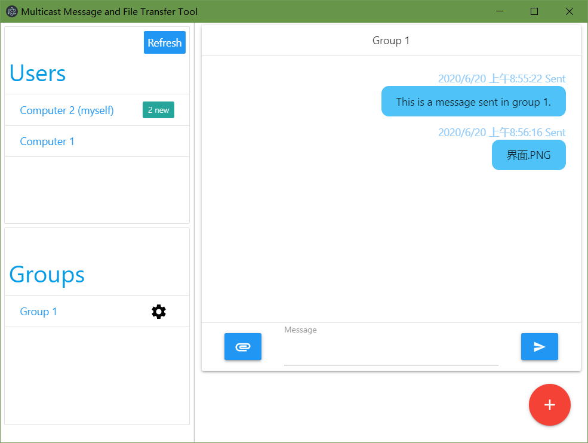

# Multicast message and file transfer tool
Author: Qiuran Hu

This program is the final project of network programming course at SEU.

I use UDP multicast functionality provided by Node.js to implement the function of transfering file and message. I use electron to create a desktop application.

To run the app, use npm start.

